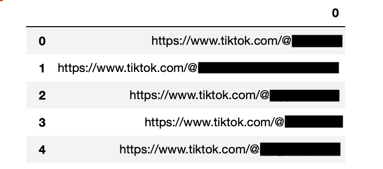
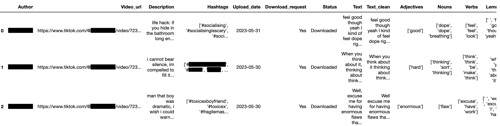
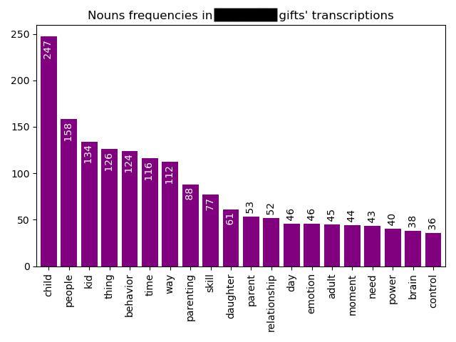

# TikTok sraping and video transcription

Full pipeline for Tiktok's video post and metadeta scraping and transcriptions analysis. 


The project consists of three main parts: 
- Metadata collection,
- Video downloading,
- Transcribing and analysis.

The most important part of the project involves collecting metadata, specifically the links to each video per TikTok channel. The challenge here is that TikTok's platform undergoes frequent changes, making it difficult to access or locate the class that contains the video links. The file "metadata_all_videos.py" was a functional solution as of May 31st, 2023, but you may need to make modifications when you use it (although you can take inspiration from it).

> Tip: an alternative to scraping the links with Python is to use other scraping tools, such as Web Scraper io (extensions available for Chrome and Firefox).

## Requirements

Create a new virtual environment and install all the necessary Python packages:

```
conda env create -f environment.yml
conda activate tiktok_scraping_and_transcription
```

To run the scraper, you will need to have a web driver. You can download the Chrome driver from this [link](https://chromedriver.chromium.org/downloads) and the Firefox driver from this [link](https://github.com/mozilla/geckodriver/releases). Personally, I used the Chrome driver for this project.

For the transcriptions and analysis, you will need to install the Whispers model and the spaCy model for the English language (or the language of the videos you're working with). You can find the installation instructions for Whispers [here](https://github.com/openai/whisper) and for spaCy [here](https://anaconda.org/conda-forge/spacy).

```
# Now install Whispers
# Now install spicy
```

## Demo of input, middle point, and ouput

How the input may look like: 

<p align="center"></p>

The final data frame for author_XXX would look like: 

<p align="center"></p>

A figure showing the first 20 most common nouns used in author_XXX's tiktoks:

<p align="center"></p>

## License 

- Refer to the LICENSE file for details on the license.
- The authors of this code not accept any responsibility for the misuse of it.
- This project was conducted under certified ethical approval.


## Author and contact details 

Dalia Ortiz Pablo (dalia.ortiz_pablo@abm.uu.se)
