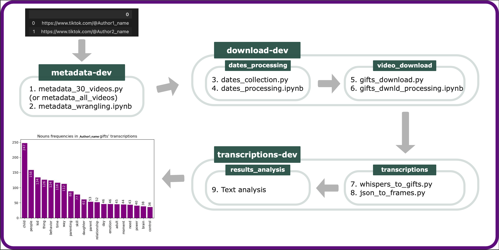

# TikTok sraping and video transcription

Full pipeline for the collection and analysis of TikTok videos and metadata with Python.  



The project consists of three main parts: 
- Metadata collection,
- Video downloading,
- Transcribing and analysis.

The most important part of the project involves collecting metadata, specifically the links to each video per TikTok channel. The challenge here is that TikTok's platform undergoes frequent changes, making it difficult to access or locate the class that contains the video links. The file "metadata_all_videos.py" was a functional solution as of May 31st, 2023, but you may need to make modifications when you use it (although you can take inspiration from it).

## Dependencies

Create a new virtual environment and install all the necessary Python packages:
```
conda env create -f environment.yml
conda activate tiktok_scraping_and_transcription
```
For the transcriptions and analysis, you will need to install the Whispers model and the spicy model for english (or the language of those videos). You can find [here](https://github.com/openai/whisper) the instalation instructions for Whispers and [here](https://anaconda.org/conda-forge/spacy) for spicy. 
